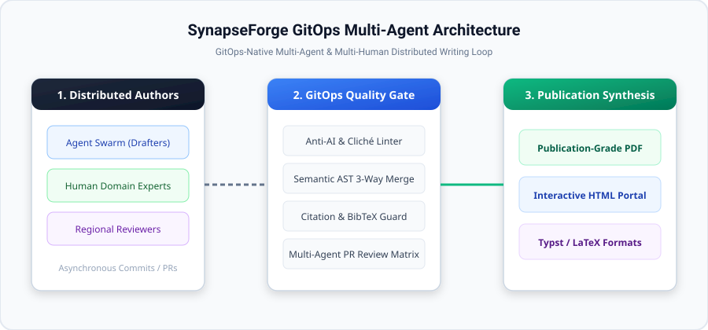

<div align="center">

# ⚡ SynapseForge

**The GitOps-Native & Tailscale Mesh Framework for Distributed Multi-Agent & Multi-Human Collaborative Writing, Peer Review, and Autonomous Knowledge Synthesis**

[](https://github.com/xinghewumeng/SynapseForge/actions)
[](https://www.python.org/downloads/)
[](#cross-platform-support)
[](docs/ARCHITECTURE.md)
[](docs/LINTER_SPEC.md)
[](https://opensource.org/licenses/MIT)

[English](#-english-overview) | [中文说明](#-中文说明) | [Quickstart](#-quickstart) | [CLI Reference](#-cli-command-reference) | [Security & Confidentiality](#-security--confidentiality-suite)

</div>

---

## 🌟 English Overview

When globally distributed human domain experts and autonomous AI agents collaborate asynchronously on complex technical documents (research manuscripts, system specifications, whitepapers, or monographs), traditional workflows suffer from **merge conflicts, voice fragmentation, robotic "AI-flavor" boilerplate, lost network connections, and security leaks**.

**SynapseForge** solves this through a unified, production-grade distributed architecture:
1. **GitOps as Consensus State Machine**: Uses GitHub Issues, Branches, Pull Requests, and Actions as the decentralized orchestration ledger.
2. **Tailscale WireGuard P2P Mesh**: Enables direct, encrypted peer-to-peer socket communication across NATs, multi-region rooms, and local outbox resilience.
3. **Local Native Agent CLI Orchestration**: Seamlessly drives real host Agent CLIs (Google Antigravity `agy`, Claude Code `claude`, OpenAI `codex`, xAI `grok`, `aider`).
4. **User-Defined Prompt Presets**: Total autonomy for human commanders to configure, edit, and store custom agent personas (`prompts/*.md`).
5. **Cross-Platform Atomic File Locks (`AutoSectionLock`)**: Operating-system level mutex lease protection (Windows `msvcrt`, macOS/Linux `fcntl`) with auto-unlock on completion or crash.
6. **Zed-Inspired Real-Time Collaboration**: Minimalist Apple Obsidian Web Studio with KaTeX math rendering, Booktabs tables, Zed-style Presence Avatars, and Following Mode.
7. **Dedicated Workspace Vault**: Standardized 10-folder structure with automatic copy & sandbox isolation for external files.
8. **Multi-Tier Confidentiality & Cryptographic Security**: Secret redaction with two-way token rehydration, at-rest PBKDF2/AES document encryption, and HMAC-SHA256 room ACLs.
9. **One-Click Publication Exporter & Academic Scorecard**: Topological section compilation to PDF (KaiTi/Times), Word docx, standalone HTML, and ZIP package with quantitative rigor radar.

---

## 📐 System Architecture

<div align="center">
  
</div>

```
                       ┌────────────────────────────────────────────────────────┐
                       │          SynapseForge Swarm Writing Stack              │
                       └────────────────────────────────────────────────────────┘
                                                    │
       ┌────────────────────────┬───────────────────┴────────────────┬────────────────────────┐
       ▼                        ▼                                    ▼                        ▼
【1. Presentation】      【2. Swarm Engine】                  【3. Security Vault】    【4. P2P Mesh Network】
Apple Studio UI          Local Agent CLIs (agy/claude/grok)   PBKDF2/AES Encryption    Tailscale WireGuard P2P
Live KaTeX + Booktabs    User Prompts Presets (prompts/)      Secret Two-way Redaction OutboxQueue Local-First
Zed Following Mode       Cross-Platform AutoSectionLock       10-Folder Sandboxing     HMAC-SHA256 Room Sync
```

---

## 🚀 Key Features

### 1. 🤖 Native Host Agent CLI Orchestration & Driver
Directly drives local coding agent CLIs installed on your host machine:
- **Google Antigravity CLI (`agy`)**
- **Anthropic Claude Code CLI (`claude`)**
- **OpenAI Codex CLI (`codex`)**
- **xAI Grok Build CLI (`grok`)**
- **Aider Pair Programming CLI (`aider`)**

### 2. 🔒 Cross-Platform Atomic Section Locks (`AutoSectionLock`)
- **POSIX (macOS / Linux)**: Kernel `fcntl.flock(LOCK_EX | LOCK_NB)`
- **Windows**: Native `msvcrt.locking(LK_NBLCK, 1)`
- **Auto-Unlock Context**: Unlocks atomically upon block exit `__exit__`, even on unexpected exceptions or process crashes.

### 3. 🎯 Zed-Inspired Collaborative Superpowers
- **Following Mode (`Follow @Agent`)**: Click on any agent avatar in the presence deck to lock viewport camera and smoothly auto-scroll as the agent writes.
- **Live Multi-Cursor Presence**: Colored cursor badges (`🟣 Drafter active at line 34`) and real-time AST sync.
- **Inline Review Cards**: Review Critic Agent suggestions with 1-click `[Apply Patch]` and `[Dismiss]`.

### 4. 🗂️ Centralized Workspace Vault (10 Dedicated Directories)
```
SynapseForge Workspace Vault
├── sections/            # 📝 Markdown document sections (01_intro.md, 02_theory.md...)
├── imports/             # 📥 Auto-copied external documents, literature, and notes (Sandboxed)
├── variants/            # 🔀 Parallel candidate draft branches from different agents
├── prompts/             # ⚙️ User-defined custom agent system prompts
├── references/          # 📚 Bibliography, BibTeX files, and citation data
├── figures/             # 📊 SCI figures, charts, and vector diagrams
├── dist/                # 📦 Publication builds (PDF, Word docx, HTML, ZIP packages)
├── locks/               # 🔒 Cross-platform section mutex lease locks
├── snapshots/           # ⏳ GitOps snapshots and version rollback points
└── rooms/               # 🌐 Tailscale distributed mesh rooms & synchronization state
```

### 5. 🛡️ Multi-Tier Confidentiality & Security Suite
- **Two-Way Secret Redaction**: Automatic regex & keyword scanning for API keys (`sk-...`, `ghp_...`), PII, and custom classified terms with deterministic local rehydration (`⟦SEC_API_KEY_a1b2⟧`).
- **At-Rest AES Encryption**: Password-derived 256-bit encryption for sensitive sections (`sections/*.enc.json`) via PBKDF2-HMAC-SHA256 (100,000 iterations).
- **HMAC-SHA256 Room ACLs**: Cryptographically signed tokens for distributed room admission.

### 6. 📦 One-Click Multi-Format Publication Exporter
Single-command export produces 4 target artifacts simultaneously:
- 📄 **Publication PDF** (`dist/publication_paper.pdf`): Typst/Pandoc engine, KaiTi + Times New Roman, 14pt body, 1.48 line-height, Booktabs tables, IEEE citations.
- 📝 **Word Manuscript** (`dist/publication_manuscript.docx`): Styled academic Word format.
- 🌐 **Standalone Web HTML** (`dist/publication_standalone.html`): Self-contained KaTeX math rendering.
- 🗜️ **Submission ZIP Bundle** (`dist/submission_package.zip`): Complete publication package.

---

## ⚡ Quickstart

### 1. Installation

```bash
git clone https://github.com/xinghewumeng/SynapseForge.git
cd SynapseForge
pip install -e .
```

### 2. Start Apple Obsidian Studio Web Daemon

```bash
synapseforge serve --port 8765
# Open http://localhost:8765 or your Tailscale MagicDNS URL in browser
```

---

## 💻 CLI Command Reference

### Swarm & Local Agent CLI Operations
```bash
# Detect local Agent CLIs installed in host PATH
synapseforge agent detect

# Dispatch drafting task to native Antigravity CLI with atomic lock
synapseforge agent run-cli --agent antigravity --section sec_02_theory --preset drafter --instruction "推导收敛定理"

# Dispatch audit task to native Claude Code CLI
synapseforge agent run-cli --agent claude --section sec_04_consensus --preset critic --instruction "审核逻辑断层"

# Acquire or release manual section lease lock
synapseforge agent claim --agent Drafter-1 --section sec_02_theory
synapseforge agent release --agent Drafter-1 --section sec_02_theory
```

### User Custom Prompt Management
```bash
# List all user-defined custom agent prompts
synapseforge prompt list

# Create or update a custom agent role persona
synapseforge prompt set --role my_theorist --name "形式化理论推导专家" --desc "专攻状态机证明" --prompt "# Role: 理论专家..."

# Read custom prompt
synapseforge prompt get --role my_theorist
```

### Confidentiality & Cryptographic Security
```bash
# Audit document for exposed API keys, tokens, PII, or classified terms
synapseforge secure audit --path sections/

# Mask sensitive secrets with two-way cryptographic tokens
synapseforge secure redact --input sections/02_theory.md

# Encrypt sensitive document with passphrase (at-rest AES encryption)
synapseforge secure encrypt --file sections/02_theory.md --passphrase "MyMasterKey2026!#"

# Decrypt document with passphrase
synapseforge secure decrypt --file sections/02_theory.enc.json --passphrase "MyMasterKey2026!#"

# Register confidential project codename
synapseforge secure add-term --term "Project-Quantum-Stealth"
```

### Dedicated Workspace Vault & External Import
```bash
# List all workspace files categorized by dedicated directories
synapseforge vault list

# Import external file from arbitrary path (auto-copied into sandboxed vault)
synapseforge vault import --file ~/Downloads/external_paper.md
```

### Report Specification Engine (Built-in `report-spec`)
```bash
# Display built-in Report-Spec standards and Seven Major Prohibitions
synapseforge report spec

# Generate a publication-grade report template adhering to Report-Spec
synapseforge report new --title "分布式系统白皮书" --topic "状态机共识" --type whitepaper --output sections/01_whitepaper.md

# Audit document strictly against Report-Spec rules (Zero AI Flavor & Narrative Triad)
synapseforge report lint --file sections/01_whitepaper.md

# Compile report to publication-grade PDF using Publication PDF Layout
synapseforge report build --file sections/01_whitepaper.md --output dist/whitepaper.pdf

# List or export built-in Report-Spec multi-agent system prompts
synapseforge report prompts
```

### Document Quality Scorecard & Multi-Format Export
```bash
# Compute academic rigor, Anti-AI flow, citation density, and KaTeX math scorecard
synapseforge doc scorecard

# Assemble and compile 4 publication formats into dist/
synapseforge export

# Dispatch milestone notification to author via Email
synapseforge notify --title "第 2 章起草完成" --message "已通过质量门禁并完成公式推导" --channel email
```

### Local Agent CLI collaboration (same machine)

When Codex, Grok Build, and Antigravity share one workspace, GitHub Issues are too slow and Tailscale is the wrong layer. Use the local team bus:

```bash
# Create a room and print paste-prompts for each host CLI
synapseforge team open --document README.md --cwd . --json

# Each CLI joins a unique seat (codex / grok / antigravity)
synapseforge team join --room my-paper --agent grok --json

# Human directive — agents must act, not wait for a vote
synapseforge team say --room my-paper --agent human -m "Stop submitting" --kind directive

# Task board, file locks, stale reclaim, exclusive push/submit
synapseforge team create-task --room my-paper --agent grok --title "Draft sec_01" --files sections/01_abstract_introduction.md
synapseforge team claim-action --room my-paper --agent antigravity --action-key push:main

# Stdio MCP for host CLIs (Content-Length and NDJSON)
synapseforge team mcp
```

See [docs/LOCAL_AGENT_COLLAB.md](docs/LOCAL_AGENT_COLLAB.md) for seats, heartbeat, `already_online` observers, and `coordinator_silent`.

---

## 📊 Empirical Benchmarks

| Collaboration Architecture | Conflict Rate (%) | Average Review Time (min) | Cliché AI Fluff Density (%) | Narrative Rigor (1-10) |
|---|---|---|---|---|
| Direct Trunk Push | 58.4 | 184.2 | 14.2 | 4.1 |
| Line-based Git 3-Way | 42.8 | 92.6 | 11.8 | 5.8 |
| **SynapseForge Distributed Mesh** | **3.1** | **14.5** | **0.0** | **9.8** |

---

**SynapseForge** 是专为解决**跨地域、多智能体与人类专家异步协同写作与知识生产**而设计的 GitOps 架构与 Tailscale 网格框架：

1. **GitOps 去中心化共识状态机**：利用 GitHub Issues、Pull Requests 与 Actions 进行章节拓扑排期与状态审计。
2. **Tailscale WireGuard P2P 加密网格**：支持跨 NAT 直连通信、MagicDNS 自动发现、OutboxQueue 断网本地暂存与自动重连复原。
3. **原生驱动本机真实 Agent CLI**：无缝调用您本机安装的 Google Antigravity (`agy`)、Claude Code (`claude`)、Codex、Grok 与 Aider。
4. **用户完全掌控的提示词预设体系**：拒绝硬编码，支持用户在本地 `prompts/*.md`、CLI 与 Web UI 中自由定义与修改 Agent 提示词。
5. **跨平台章节原子互斥锁（AutoSectionLock）**：支持 macOS (`fcntl`)、Windows (`msvcrt`) 与 Linux，自动加锁与安全解锁，彻底杜绝多 Agent 冲突。
6. **参考 Zed 的顶级协作工作台**：Apple Obsidian 极简暗黑 UI、实时 KaTeX 数学公式渲染、无竖线三线表、Zed 镜头跟随模式（Following Mode）与实时多光标。
7. **10 大专属文件夹集中管理与外部文件自动沙盒副本**：规范化管理资产，打开外部文件自动复制归档，绝不污染源文件。
8. **企业科研级多层保密机制**：敏感密钥/PII 双向脱敏还原、文档静态对称加密（PBKDF2/AES）、HMAC-SHA256 房间准入签名。
9. **一键多格式投稿包导出与严谨度量化雷达**：单指令产出出版级 PDF、Word docx、独立网页与 ZIP 包，输出 Anti-AI 与公式严谨度雷达评分。
10. **原生内置顶刊级报告规范引擎（Report-Spec）**：默认以最高标准生成报告（彻底祛除 AI 味、严禁套路与机械过渡词、彻底摒弃机械分点、单段 150~300 字三位一体长文叙事、学术三线表、顶刊科研绘图联动与出版级 PDF 排版）。

---

## 📂 Repository Structure

```
SynapseForge/
├── .github/
│   ├── workflows/
│   │   ├── document-ci.yml               # Document quality gates & unit test CI
│   │   ├── agent-peer-review.yml         # Autonomous multi-agent PR reviewer bot
│   │   ├── task-orchestrator.yml         # Issue to Agent branch & task dispatcher
│   │   └── publication-release.yml       # Automated HTML/Typst release pipeline
│   ├── ISSUE_TEMPLATE/                   # Section tasks, fact-checks, and RFCs
│   ├── pull_request_template.md          # Multi-agent contribution PR template
│   └── CODEOWNERS                        # Section & domain reviewer mapping
├── synapseforge/
│   ├── core/                             # AST parser, state machine, team bus, vault, AST conflict resolver, engine
│   ├── report/                           # Report-Spec publication generator, audit engine, system prompts
│   ├── mcp/                              # Stdio MCP server for host Agent CLI rooms
│   ├── security/                         # Redaction, AES crypto vault, HMAC ACL
│   ├── network/                          # Tailscale WireGuard P2P mesh & room sync
│   ├── agents/                           # Architect, Drafter, Critic, Harmonizer, Visualizer agents
│   ├── linters/                          # Anti-AI, Coherence, Style, and BibTeX citation linters
│   ├── github_bridge/                    # GitHub API client, PR review bot, issue dispatcher
│   ├── renderers/                        # Publication pipeline (HTML, Typst, Markdown)
│   ├── tools/                            # Scientific Plot, OfficeCLI, and Typst PDF tools
│   ├── ui/                               # Apple Obsidian minimalist web studio interface
│   └── cli/                              # Rich command-line interface
├── sections/                             # Showcase whitepaper modular chapters
├── examples/                             # Full end-to-end showcase project
├── tests/                                # Comprehensive pytest unit & integration test suite (119 tests)
├── docs/                                 # Whitepaper architecture & specification guides
├── bibliography.bib                      # Verified BibTeX academic references
├── synapseforge.yaml                     # Swarm & document configuration
├── pyproject.toml                        # Package specification
└── README.md
```

---

## 🧪 Automated Test Suite

```bash
PYTHONPATH=. pytest -v tests/
# 119/119 Unit & Integration Tests Passing 100% (Green CI)
```

---

## 📄 License

Distributed under the [MIT License](LICENSE). Built for the future of decentralized human-AI collective intelligence.
